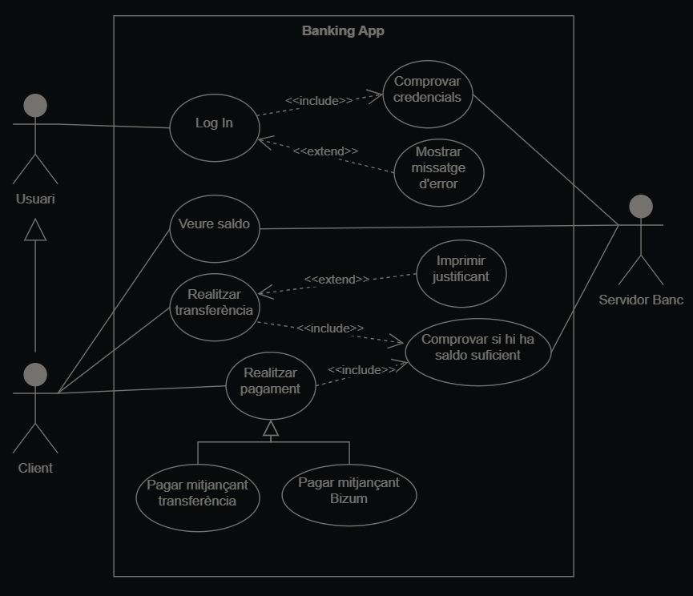

# Diagramas de casos de uso

Los diagramas de casos de uso son diagramas de comportamiento UML que modelan las interacciones entre un sistema y sus actores, representando los requisitos funcionales del sistema.

---

## Elementos de un diagrama de casos de uso

### Sistemas
- **Definición:** Representa el sistema o aplicación de software modelado.
- **Representación:** Rectángulo con casos de uso dentro y actores fuera.

### Actores
- **Definición:** Entidades que interactúan con el sistema.
- **Representación:** Figuras de palo fuera del rectángulo del sistema.
- **Tipos:**
  - **Primarios:** Interactúan directamente para lograr un objetivo.
  - **Secundarios:** Interactúan indirectamente, facilitando las interacciones.

### Casos de uso
- **Definición:** Descripción de tareas o funciones específicas del sistema.
- **Representación:** Óvalos con el nombre del caso de uso dentro.
- **Conexión:** Conectados con actores mediante líneas o flechas.
- **Ejemplos:** Ver saldo, Realizar transferencia.

### Relaciones
- **Definición:** Conexiones entre elementos del diagrama.
- **Tipos:**
  - **Asociaciones:** Líneas que conectan actores con casos de uso.
  - **Include:** Caso de uso que siempre incluye a otro.
  - **Extend:** Caso de uso que agrega pasos opcionales a otro.
  - **Generalización (Herencia):** Un elemento es un tipo más específico de otro.

---

## Representaciones

- **Asociación:** 
  ```
  ____________________________
  ```

- **Include:** 
  ```
  -------<<include>>--------->
  ```

- **Extend:** 
  ```
  -------<<extend>>---------->
  ```

- **Herencia (Generalización):**
  ```
  ------
        |
        ----- >
        |
  ------
  ```

  # Ejemplo completo
 
